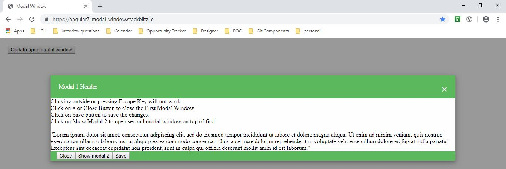
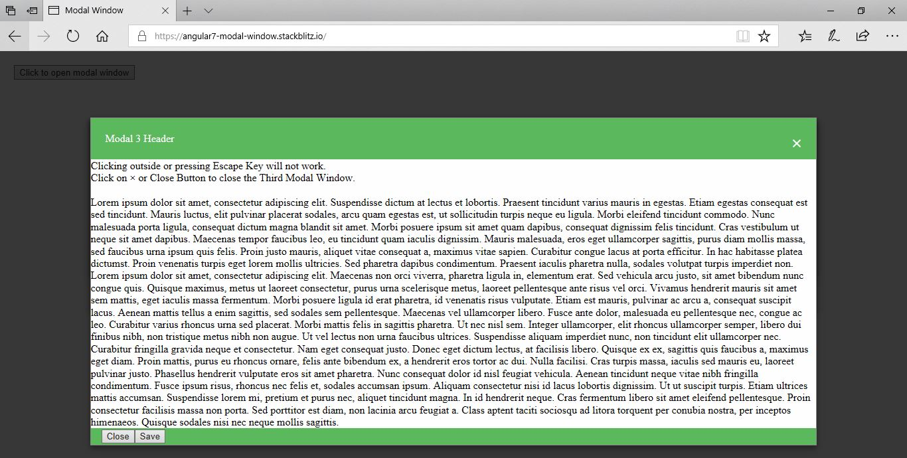
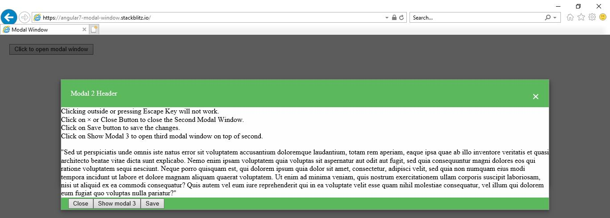

# Modal Window

Modal Window created using Angular 7 to provide consistent behavior across multiple browsers and viewports without using traditional constructs like Bootstrap or jquery which doesn't support Stacking of Modals on top of another.
The user can create nested modal windows upto any number of levels and customize the modal window by styling its header, body and footer.
The modals by default overlap parent modal windows and this beghavior can be customized by changing .modal class in modal.component.css







## Demo

Checkout the demo on StackBlitz - https://angular7-modal-window.stackblitz.io/ 

## Adding the component in your project

### Add Component and Directives in module
Import
`
import { ModalComponent } from './components/modal/modal.component';
`

Declaration
`
declarations: [
     ModalComponent
  ]
`
### Add selector in HTML
```
<app-modal #modal1 [current]="'modal1'" 
    [previous]="null" [buttonGroup]="buttonGroup">
        <!-- First Modal Component-->
    <app-first-component [modal]="modal1">
    </app-first-component>
</app-modal>
```
```
<app-modal [buttonGroup]="buttonGroup" [current]="'modal2'" 
  [previous]="'modal1'" #modal2>
   <!-- Second Modal Component-->
    <app-second-component [modal]="modal2"></app-second-component>
</app-modal>
```

### Selector Properties
Property `current` represents current modal reference name like 'modal1'. 
`previous` represents previous modal reference name like null in the above case.
Property `modal` represents current modal template reference like `#modal1` in the above case.

If second modal (`modal2`) gets opened on top of first modal (`modal1`) then `current` becomes `modal2`, previous becomes `modal1` and `modal` becomes `#modal2`

```
@ViewChild('modal2') modal2;
```
Property `buttonGroup` represents class being used for action buttons in the footer like `modal-footer` in the modal created in the below example.

```
  <div [ngClass]="buttonGroup">
    <button type="button" class="btn  btn-autosize btn-default" (click)="modal.hide()">Close</button>
    <button type="button" class="btn btn-autosize btn-default" (click)="modal2.show()">Show modal 2</button>
    <button type="button" class="btn  btn-autosize btn-primary" (click)="save()">Save</button>
  </div>
```
### modal.component.ts
``` typescript
import { Component, OnInit, Inject, Input} from '@angular/core';
import { DOCUMENT } from '@angular/common';

@Component({
  selector: 'app-modal',
  templateUrl: './modal.component.html',
  styleUrls: ['./modal.component.css']
})
export class ModalComponent implements OnInit {

  @Input() current;

  @Input() previous;

  @Input() buttonGroup;

  public visible = false;
  public visibleAnimate = false;

  constructor(@Inject(DOCUMENT) private document: Document) { }

  ngOnInit() {
  }

  public show(): void {
    let previousbuttons;
    this.visible = true;
    setTimeout(() => {
      this.visibleAnimate = true;
    }, 100);
    if (this.previous) {
      previousbuttons = this.document.body.querySelector('#' + this.previous + ' .' + this.buttonGroup).getElementsByTagName('button');
      for (const button of previousbuttons) {
        button.disabled = true;
      }
     }
  }

  public hide(): void {
    let previousbuttons;
    this.visibleAnimate = false;
    setTimeout(() => {
      this.visible = false;
    }, 100);
   if (this.previous) {
    previousbuttons = this.document.body.querySelector('#' + this.previous + ' .' + this.buttonGroup).getElementsByTagName('button');
    for (const button of previousbuttons) {
      button.disabled = false;
    }
   }
  }

  public onContainerClicked(event: MouseEvent): void {
    if ((<HTMLElement>event.target).classList.contains('modal')) {
      this.hide();
    }
  }
}
```

### modal.component.html
``` html
<div class="modal fade" aria-hidden="true" tabindex="0" id="{{current}}"
[ngClass]="{'in': visibleAnimate}"
[ngStyle]="{'display': visible ? 'block' : 'none', 'opacity': visibleAnimate ? 1 : 0}">
  <div class="modal-dialog modal-lg modal-dialog-centered">
    <div class="modal-content">
        <ng-content></ng-content>
    </div>
  </div>
</div>
<div [class.modal-overlay]="visible==true" tabindex="-1">
</div>
```

### modal.component.css
``` css
   /* The Modal (background) */
.modal {
  display: none; /* Hidden by default */
  position: fixed; /* Stay in place */
  z-index: 1; /* Sit on top */
  padding-top: 100px; /* Location of the box */
  left: 0;
  top: 0;
  width: 100%; /* Full width */
  height: 100%; /* Full height */
  overflow: auto; /* Enable scroll if needed */
  background-color: rgb(0,0,0); /* Fallback color */
  background-color: rgba(0,0,0,0.4); /* Black w/ opacity */
}

/* Modal Content */
.modal-content {
  position: relative;
  background-color: #fefefe;
  margin: auto;
  padding: 0;
  border: 1px solid #888;
  width: 80%;
  box-shadow: 0 4px 8px 0 rgba(0,0,0,0.2),0 6px 20px 0 rgba(0,0,0,0.19);
  -webkit-animation-name: animatetop;
  -webkit-animation-duration: 0.4s;
  animation-name: animatetop;
  animation-duration: 0.4s
}
  

  body {
    font-family: Arial, Helvetica, sans-serif;
  }


/* Add Animation */
@-webkit-keyframes animatetop {
  from {top:-300px; opacity:0} 
  to {top:0; opacity:1}
}

@keyframes animatetop {
  from {top:-300px; opacity:0}
  to {top:0; opacity:1}
}
```

## First Modal Window

### first-component.component.ts
``` typescript
import { Component, OnInit, Input, ViewChild, TemplateRef, Output, EventEmitter } from '@angular/core';
import { HTML_CODES} from '../../constants/constants';

@Component({
  selector: 'app-first-component',
  templateUrl: './first-component.component.html',
  styleUrls: ['./first-component.component.css']
})
export class FirstComponentComponent implements OnInit {

  @Input() modal;

  @ViewChild('modal2') modal2;

  public buttonGroup = 'modal-footer';

  public close = HTML_CODES.close;

  constructor() { }

  ngOnInit() {
  }

  save() {
    alert('changes for Modal 1 saved');
  }
}

```
### first-component.component.html
``` html
  <div class="modal-header">
    Modal 1 Header
    <span class="close" [innerHTML]="close" (click)="modal.hide()"></span>
  </div>
  <div class="modal-body">
    <div>Clicking outside or pressing Escape Key will not work.</div>
    <div>Click on <span [innerHTML]="close"></span> or Close Button to close the First Modal Window.</div>
    <div>Click on Save button to save the changes.</div>
    <div>Click on Show Modal 2 to open second modal window on top of first.</div>
    <br/>
    <div>
        "Lorem ipsum dolor sit amet, consectetur adipiscing elit, sed do eiusmod tempor incididunt ut labore et dolore magna aliqua. Ut enim ad minim veniam, quis nostrud exercitation ullamco laboris nisi ut aliquip ex ea commodo consequat. Duis aute irure dolor in reprehenderit in voluptate velit esse cillum dolore eu fugiat nulla pariatur. Excepteur sint occaecat cupidatat non proident, sunt in culpa qui officia deserunt mollit anim id est laborum."
    </div>
  </div>
  <div [ngClass]="buttonGroup">
    <button type="button" class="btn  btn-autosize btn-default" (click)="modal.hide()">Close</button>
    <button type="button" class="btn btn-autosize btn-default" (click)="modal2.show()">Show modal 2</button>
    <button type="button" class="btn  btn-autosize btn-primary" (click)="save()">Save</button>
  </div>
<app-modal [buttonGroup]="buttonGroup" [current]="'modal2'" [previous]="'modal1'" #modal2>
     <!-- Second Modal Component-->
    <app-second-component [modal]="modal2"></app-second-component>
</app-modal>
```
## Second Modal Window

### second-component.component.ts
``` typescript
import { Component, OnInit, Input, ViewChild} from '@angular/core';
import { HTML_CODES} from '../../constants/constants';

@Component({
  selector: 'app-second-component',
  templateUrl: './second-component.component.html',
  styleUrls: ['./second-component.component.css']
})
export class SecondComponentComponent implements OnInit {

  @Input() modal;

  @ViewChild('modal3') modal3;

  public buttonGroup = 'modal-footer';

  public close = HTML_CODES.close;

  constructor() { }

  ngOnInit() {
  }

  save() {
    alert('changes for Modal 2 saved');
  }
}

```
### second-component.component.html
``` html
      <div class="modal-header">
  Modal 2 Header
  <span class="close" [innerHTML]="close" (click)="modal.hide()"></span>
</div>
    <div class="modal-body">
        <div>Clicking outside or pressing Escape Key will not work.</div>
        <div>Click on <span [innerHTML]="close"></span> or Close Button to close the Second Modal Window.</div>
        <div>Click on Save button to save the changes.</div>
        <div>Click on Show Modal 3 to open third modal window on top of second.</div>
        <br/>
        <div>
            "Sed ut perspiciatis unde omnis iste natus error sit voluptatem accusantium doloremque laudantium, totam rem aperiam, eaque ipsa quae ab illo inventore veritatis et quasi architecto beatae vitae dicta sunt explicabo. Nemo enim ipsam voluptatem quia voluptas sit aspernatur aut odit aut fugit, sed quia consequuntur magni dolores eos qui ratione voluptatem sequi nesciunt. Neque porro quisquam est, qui dolorem ipsum quia dolor sit amet, consectetur, adipisci velit, sed quia non numquam eius modi tempora incidunt ut labore et dolore magnam aliquam quaerat voluptatem. Ut enim ad minima veniam, quis nostrum exercitationem ullam corporis suscipit laboriosam, nisi ut aliquid ex ea commodi consequatur? Quis autem vel eum iure reprehenderit qui in ea voluptate velit esse quam nihil molestiae consequatur, vel illum qui dolorem eum fugiat quo voluptas nulla pariatur?"
        </div>
    </div>
  <div [ngClass]="buttonGroup">
    <button type="button" class="btn  btn-autosize btn-default" (click)="modal.hide()">Close</button>
  <button type="button" class="btn  btn-autosize btn-default" (click)="modal3.show()">Show modal 3</button>
  <button type="button" class="btn  btn-autosize btn-primary" (click)="save()">Save</button>
</div>
<app-modal  [buttonGroup]="buttonGroup" [current]="'modal3'" [previous]="'modal2'" #modal3>
    <!-- Third Modal Component-->
    <app-third-component [modal]="modal3"></app-third-component>
</app-modal>
```
## Styles for making the modal windows responsive and compatible across browsers

### styles.css
```css
.modal-body {
  max-height:50vh !important;
  overflow: auto !important;
  padding:2%;
}

.modal-header {
  max-height: 10vh !important;
  background-color: #5cb85c;
  color: white;
  padding:2%;
}

.modal-footer {
  height: 100% !important;
  max-height:10vh !important; 
  padding: 2px 16px;
background-color: #5cb85c;
color: white;
}
/* The Close Button */
.close {
  color: white;
  float: right;
  font-size: 28px;
  font-weight: bold;
}

.close:hover,
.close:focus {
  color: #000;
  text-decoration: none;
  cursor: pointer;
}

.instruction {
    margin:10px;
    top:10px;
  }

  .btn {
    white-space: normal !important
  }
```
## Author

parasmani.jain2208@gmail.com
